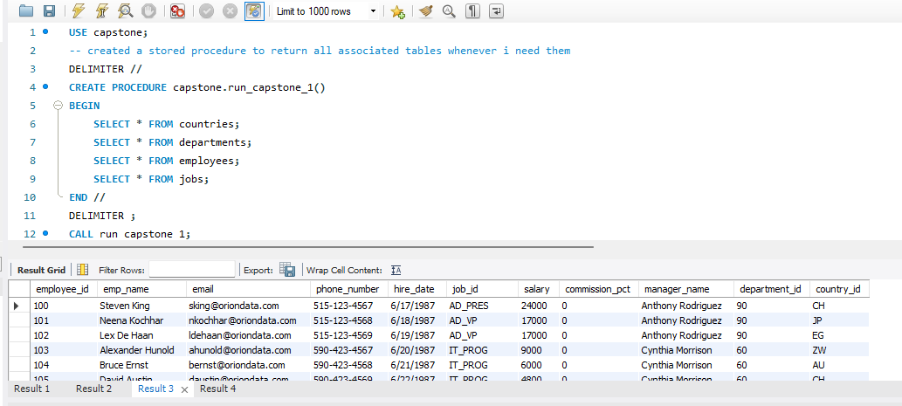
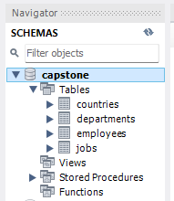

# Orion-Data-Systems-Workforce-SQL-Analytics

Orion Data Systems is a multinational consulting and technology firm headquartered in  San Francisco, USA, with offices spanning Europe, Asia, and the Americas. This project  simulates a real-world data analyst engagement where the HR &amp; Strategy team needed  SQL-driven insights from their workforce database to support business decision-making.

This capstone covers eight business questions spanning workforce distribution, salary 
analysis, country-level operations, and workforce gap identification.


## Database Schema
| Table | Key Columns |
|-------|------------|
| `employees` | employee_id, emp_name, email, phone_number, hire_date, job_id, salary, commission_pct, manager_name, department_id, country_id |
| `departments` | department_id, department_name, manager_id, location_id |
| `jobs` | job_id, job_title, min_salary, max_salary |
| `countries` | country_id, country_name, region |

The first query on the SQL dataset runs a stored procedure to return all associated tables in the dataset.
## Dataset Tables


## 📂 Dataset
The raw data used for this analysis is provided as CSV files. These were imported into 
MySQL under the `capstone` schema to form the working database.

### Schema Structure



| File | Description |
|------|-------------|
| [`countries.csv`](./countries.csv) | List of countries and regions where Orion operates |
| [`departments.csv`](./departments.csv) | Department names, managers, and locations |
| [`employees.csv`](./employees.csv) | Full employee records including salary, job, and location |
| [`jobs.csv`](./jobs.csv) | Job titles with defined minimum and maximum salary ranges |

> 💡 To replicate this analysis, import each CSV into its corresponding table inside 
> your `capstone` schema before running the SQL file.

## Business Questions & Approach

> 📂 Full SQL solutions are in [`innocent_daniel_SQL_CAPSTONE.sql`](./innocent_daniel_SQL_CAPSTONE.sql)


### 1. Workforce Distribution

**Question:** How many employees are in each department, and which department has the highest headcount?

**Concepts:** `SELECT` `COUNT` `GROUP BY` `ORDER BY`

**Finding:** The **Shipping** department has the highest employee headcount.

### 2. Salary Comparison
**Question:** What is the average salary per department? Which department has the highest and lowest average salaries?

**Concepts:** `AVG` `GROUP BY` `ORDER BY` `CTE`

### 3. Salary Bands for Employees
**Question:** Classify all employees into salary bands and count how many fall into each.

| Band | Salary Range |
|------|-------------|
| Low | < 5,000 |
| Medium | 5,000 – 10,000 |
| High | > 10,000 |

**Concepts:** `CASE` `COUNT` `GROUP BY`

### 4. Country-Level Analysis
**Question:** In which countries does Orion Data Systems operate, and how many departments exist per country?

**Concepts:** `JOIN` `GROUP BY` `COUNT` `DISTINCT`

### 5. High Earners
**Question:** Which employees earn above the company-wide average salary?

**Concepts:** `Subquery` `AVG` `WHERE`

### 6. Job Role Analysis
**Question:** What is the average salary per job title? Which job titles average above $12,000?

**Concepts:** `JOIN` `AVG` `GROUP BY` `HAVING` `ORDER BY`

### 7. Salary Growth Trend
**Question:** What is the total salary expenditure per country, ordered highest to lowest?

**Concepts:** `JOIN` `SUM` `GROUP BY` `ORDER BY`

### 8. Workforce Gaps
**Question:** Which job roles currently have no employees assigned?

**Concepts:** `JOIN` `WHERE` `IS NULL`

## SQL Concepts Demonstrated

| Concept | Used In |
|--------|---------|
| `SELECT`, `WHERE`, `ORDER BY` | All queries |
| `INNER JOIN` | Q1, Q2, Q4, Q6, Q7, Q8 |
| `GROUP BY`, `COUNT`, `AVG`, `SUM` | Q1, Q2, Q3, Q4, Q6, Q7 |
| `CASE` (conditional logic) | Q3 |
| Subquery | Q5 |
| `HAVING` | Q6 |
| `CTE` (Common Table Expression) | Q2 |
| `IS NULL` | Q8 |
| `DISTINCT` | Q4 |
| `ROUND` | Q2, Q5, Q6 |
| Stored Procedure | Setup |

## 📁 File Structure
```
📦 orion-workforce-analytics/
 📄 README.md
 📄 innocent_daniel_SQL_CAPSTONE.sql
 📊 employees.csv
 📊 departments.csv
 📊 jobs.csv
 📊 countries.csv
``` 
## ▶️ How to Run

1. **Set up MySQL** (v8.0+ recommended)
2. **Create the schema:**
```sql
   CREATE SCHEMA capstone;
   USE capstone;
```
3. **Import the CSV files** into their corresponding tables inside the `capstone` schema
   (`employees`, `departments`, `jobs`, `countries`)
4. **Open and run** `innocent_daniel_SQL_CAPSTONE.sql` in your MySQL client
5. **Use the built-in stored procedure** to load all tables at once:
```sql
   CALL run_capstone_1;
```
## Author

**Innocent Daniel**  
Junior Data Analyst  
*SQL Capstone Project - Orion Data Systems Workforce Analytics*

> 💡 *This project was completed as part of a data analytics capstone exercise to demonstrate 
> proficiency in MySQL for real-world HR analytics use cases.*
